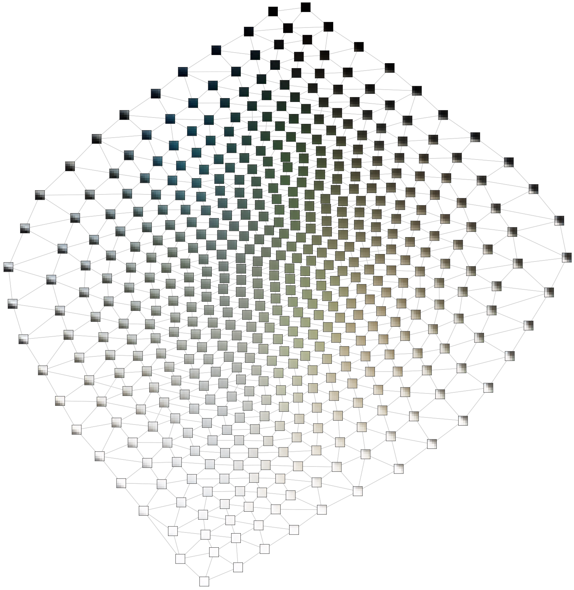

# Neural-Gas VAE

The Neural-Gas VAE is an improved version of the VQ-VAE that avoids
index collapse and creates a representation of a manifold as a graph
between codebook vectors.

 

Here, you find an implementation of the Neural-Gas VAE and the VQ-VAE implementations
used in the paper. I used the packages torch, torchvision, torchaudio, numpy, networkx,
pandas, einops, seaborn, and pytorch_lightning in the current version.

To reproduce the experiments from the paper you may run the experimentation files on the
top level and get the data from the tensorboard instance. If you are just interested in
the implementation look in autoencoding/modules/gvqvae.py.

If you just want to look at the resulting data have a look at the raw_data. There is also
the evaluation.py script which creates the plots used in the paper.
